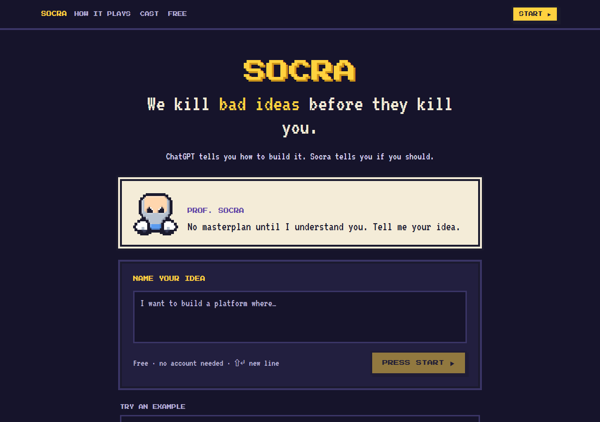
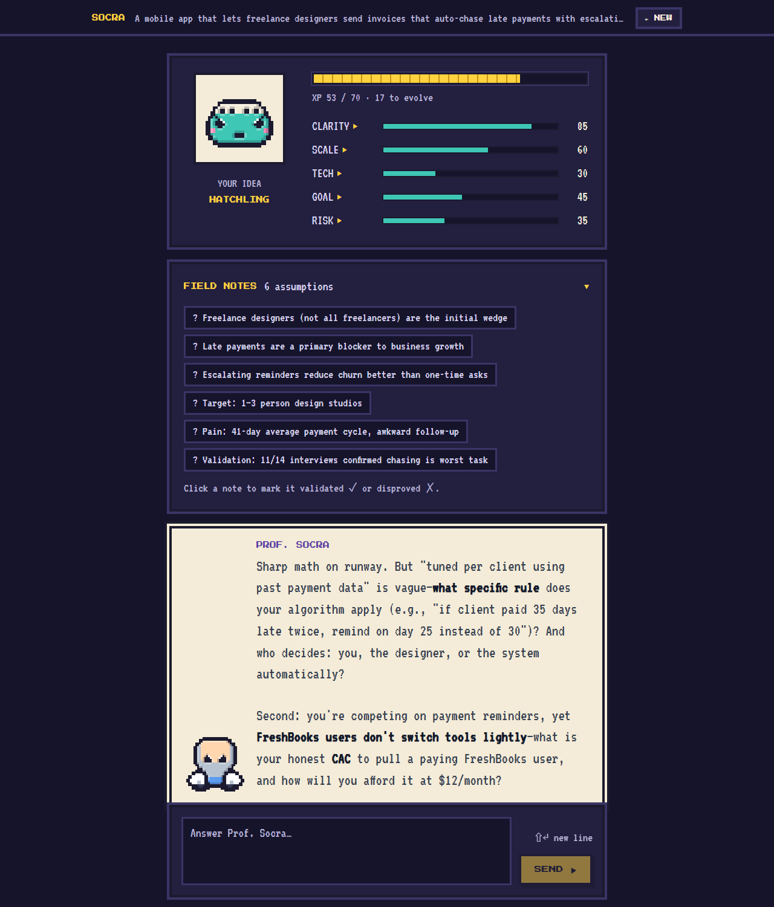
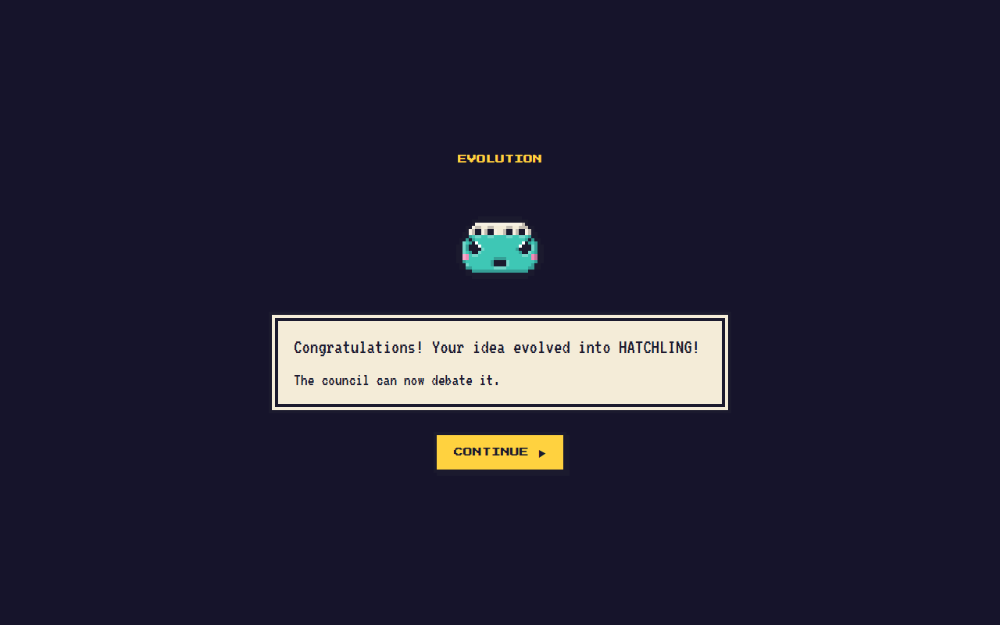
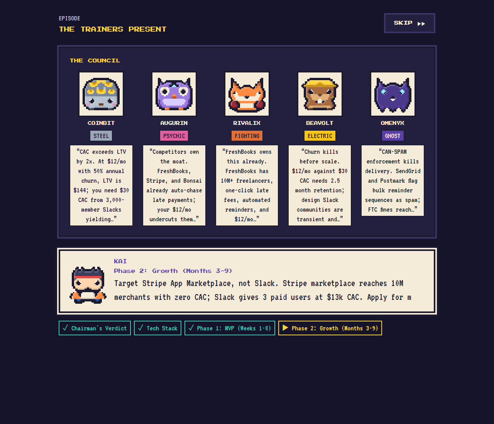
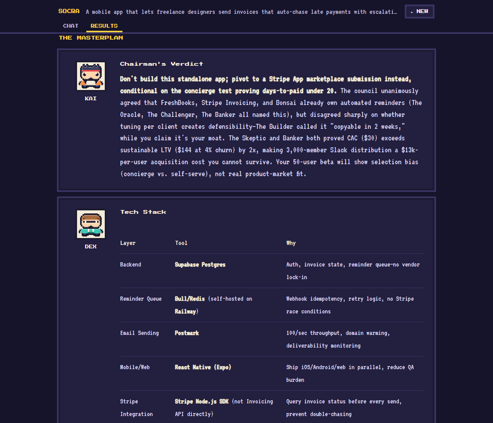
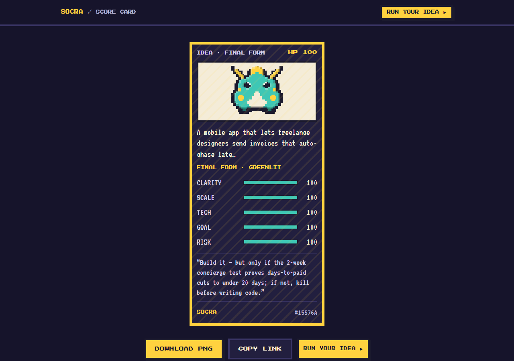

<div align="center">


# Socra

**We kill bad ideas before they kill you.**

An AI startup evaluator that refuses to hand you a plan until it understands your idea. It interrogates you Socratically, puts the idea in front of a council of five AI advisors, and only then writes the masterplan, presented as a retro creature-collector game.

[**Try it live**](https://socra-frontend-efmq.onrender.com) · [How it works](#how-it-works) · [Run it locally](#run-it-locally)

[](https://github.com/CaringNihilistic/PROJECT-_Socra/actions/workflows/ci.yml)



</div>

> The live demo runs on free tiers: after 15 idle minutes the first request takes about a minute to wake the server.

## Why

ChatGPT tells you how to build it. Socra tells you if you should. Most AI tools are built to agree with you; Socra is built to find the assumption that kills your idea in year one, with named competitors, real prices and actual regulations, before you quit your job for it.

## How it works

| 1. Interrogation | 2. The council | 3. The masterplan |
|---|---|---|
| Prof. Socra asks one or two sharp questions per turn and challenges vague answers. Every answer scores your idea on five weighted stats, and it **evolves** from Idea Egg to Final Form as the score climbs. | At 80% the council convenes: five advisors research the market live on the web, each hunting a different reason the idea fails: the money, the market, rivals, the build, the risk. | The Chairman synthesizes a crisp plan (verdict, tech stack, three phases, risk register, first three files). Then Team Glitch ambushes it with five reasons it fails. |

<table>
<tr>
<td width="50%"></td>
<td width="50%"><br/><br/></td>
</tr>
<tr>
<td width="50%"></td>
<td width="50%" align="center"></td>
</tr>
</table>

Every result is shareable: a read-only plan page where visitors can replay the council episode, a trading card that downloads as a PNG, and a VS screen that compares two ideas stat by stat.

### The five stats

| Stat | Weight | | Stage | Unlocks at |
|---|---|---|---|---|
| Clarity (the problem) | 25% | | Idea Egg | 0% |
| Scale & constraints | 20% | | Hatchling | 40% |
| Tech context | 20% | | Evolved | 70% |
| Success definition (goal) | 20% | | Final Form: the council runs | 80% |
| Risk awareness | 15% | | | |

### The cast

All original characters, drawn in code as 32×32 pixel sprites.

- **Prof. Socra**, the interrogator.
- **The council**: Coinbit (Steel, finance), Augurin (Psychic, market), Rivalix (Fighting, competition), Beavolt (Electric, tech), Omenyx (Ghost, risk).
- **The trainers** who present the plan: Kai, Dex and Marin.
- **Team Glitch**, the devil's advocates: Hex, Rook and Gremlix.

## Engineering highlights

- **Streaming multi-agent pipeline.** One Server-Sent Events stream carries the chat reply, then, if the turn crosses 80%, web research, five parallel agent reports, the token-by-token masterplan and the critique. The council can also run as a **LangGraph** `StateGraph` (parallel fan-out, `operator.add` reducer, Postgres checkpoints on a fresh thread per run).
- **Provider fall-through.** Every LLM call goes Anthropic Claude Haiku 4.5 → Google Gemini → Groq and falls through on any failure, including a dead or out-of-credit key. With only a Groq key the app runs entirely free.
- **Crisp by contract.** Prompts fix the output shape: replies under 60 words, reports of exactly four bullets that each lead with a bold verdict, and a masterplan filled into a 7-heading template, prefilled on Anthropic. Tests pin the headings the frontend splits the plan on. A full session costs about **$0.05**.
- **One episode engine for live, replay and demo.** A pure reducer plus a pacer turns the SSE events into the council "episode". The live run, the saved-session replay and the landing page's demo (a real recorded run) all go through it, and a replayed episode matches the live one.
- **Pixel art without image files.** Sprites are 16-row half-grids, mirrored, upscaled with Scale2x/EPX and rim-shaded, then rendered as crisp SVG paths at whole-pixel sizes only. The share card exports to PNG in the browser with the pixel fonts inlined.
- **Accessible by default.** WCAG AA colour pairs, keyboard-only play (menus, dialogs with focus traps, Esc to skip), `prefers-reduced-motion` support, and no horizontal scroll at 375px.

## Tech stack

| | |
|---|---|
| **Frontend** | React 18, TypeScript, Vite, Tailwind CSS, Zustand, react-markdown, html-to-image; Press Start 2P + VT323 |
| **Backend** | Python 3.11, FastAPI, SQLAlchemy (asyncio) + asyncpg, PostgreSQL |
| **AI** | Anthropic Claude Haiku 4.5, Google Gemini, Groq; LangGraph; Tavily web search; Langfuse tracing |
| **Services** | Clerk (optional auth), Razorpay (optional donations), Resend (follow-up email) |
| **Hosting** | Render (Docker backend + static frontend, [render.yaml](render.yaml)) and Neon Postgres, all on free tiers |
| **Quality** | 170 Vitest tests and a pytest suite, run with the production build on every push (GitHub Actions) |

## Run it locally

You need Docker, and at least one LLM key (a free [Groq](https://console.groq.com) key works).

```bash
git clone https://github.com/CaringNihilistic/PROJECT-_Socra.git
cd PROJECT-_Socra
cp .env.example .env        # add ANTHROPIC_API_KEY or GROQ_API_KEY
docker compose up           # Postgres, backend on :8000, frontend on :3000
```

Open http://localhost:3000. The API docs are at http://localhost:8000/docs.

**No key?** Set `STUB_MODE=true` for canned answers to the three example ideas on the landing page.

Every setting is documented in [.env.example](.env.example); only an LLM key is required. Without Clerk the app runs signed-out.

<details>
<summary>Without Docker</summary>

```bash
# backend (needs a Postgres; set DATABASE_URL in backend/.env)
cd backend
pip install -r requirements.txt
uvicorn main:app --reload --port 8000

# frontend, in a second terminal
cd frontend
npm install
npm run dev                 # http://localhost:3000
```

</details>

### Tests

```bash
cd frontend && npm test && npm run build     # Vitest, then the typecheck + production build
cd backend && pytest                          # pytest
```

The dev server also has three pages for working on the UI without a backend: `/__pixel` (the sprite kit), `/__episode` (the council episode on a recorded run) and `/__chat` (the interrogation screen and every evolution).

## Deploy

[render.yaml](render.yaml) is a Render Blueprint for both services: a Docker web service for the backend and a static site for the frontend, with an SPA rewrite so `/share`, `/card` and `/compare` links resolve. Create a free [Neon](https://neon.tech) Postgres and use its direct connection string as `DATABASE_URL`. Pushes to `main` redeploy automatically. `VITE_*` variables are baked in at build time, so changing them needs a rebuild.

## Project structure

```
backend/
  main.py               FastAPI app, CORS, rate limiting, /health
  llm_client.py         provider routing, prompts, council agents, masterplan synthesis
  llm_graph/            LangGraph council pipeline + Postgres checkpointer
  eval_bar.py           the five weighted stats and phase thresholds
  api/routes/           sessions, streaming chat + council, billing, follow-ups
frontend/src/
  pixel/                sprites, cast, pixel UI kit
  episode/              the council episode engine (reducer, pacer, replay)
  chat/ landing/ share/ pure helpers behind each screen
  components/           the screens: landing, chat, council, results, card, share, compare
  store/sessionStore.ts all state, API calls and SSE streaming
docs/superpowers/specs/ design specs for the pixel redesign
```

Architecture notes for contributors are in [CLAUDE.md](CLAUDE.md).

## License

[MIT](LICENSE)
